# Hi there 👋, I'm Tuan Tran

**Full-stack Developer based in Ho Chi Minh City 🇻🇳**

I build clean, performant web applications and care deeply about software architecture and modern development workflows.

🔗 **Portfolio:** [hituan.vercel.app](https://hituan.vercel.app)
📫 **Reach me:** tranttuan96@gmail.com

---

### 🚀 What I'm currently building
- 🏡 **HomeHub (Private):** A personal finance & asset management platform built with **Turborepo**, **NestJS monolith**, and cutting-edge AI integrations (**Gemini RAG + MCP Server**).
- 🌸 **[Nhung Growth Hub](https://github.com/tranttuan96/nhung-growth-hub):** A high-performance lead generation & portfolio website built with **Astro** for optimized SEO and speed.
- 💼 **Career Platforms (WIP):** Architecting modern job board & career guidance platforms (`Job Pilot` & `Career Copilot`).
- 🌐 **[My Portfolio](https://github.com/tranttuan96/my-portfolio):** The source code for my minimalist portfolio built with Vite and TypeScript.

---

### 📊 GitHub Activity

  

### 🛠️ Tech Stack & Tools

  

